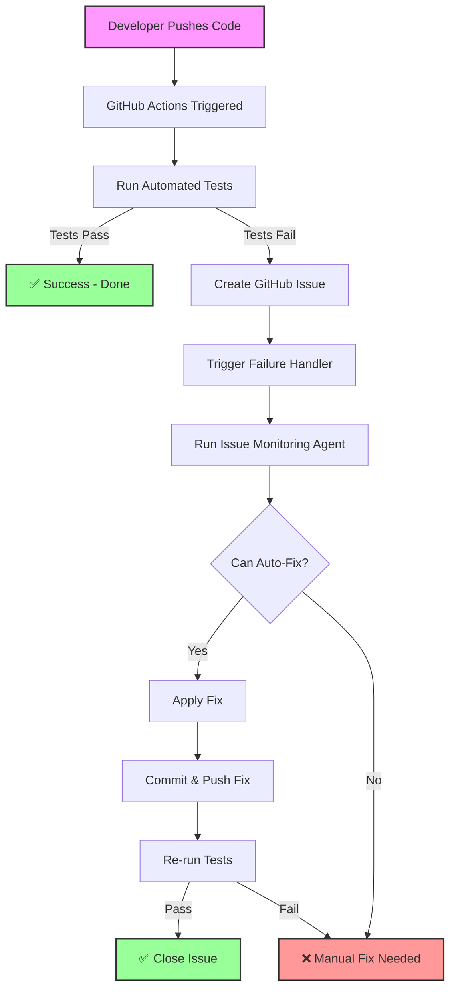

# 🏗️ Automated Bug Resolution System Architecture

This document explains where and how the automated bug tracking and resolution system runs.

## 🚀 Everything Runs on GitHub!

**✅ All automated processes run on GitHub Actions infrastructure**  
**✅ No local laptop/computer required once pushed**  
**✅ Triggers on events, not just periodic checks**  
**✅ Fully automated from detection to resolution**

## 🔄 Event-Driven Architecture

### 1. **Test Execution** (On Every Push/PR)

**Workflow:** `.github/workflows/tests.yml`  
**Triggers:** 
- Push to main/develop branches
- Pull request creation/update
- Manual dispatch

**What happens:**
```
Push Code → GitHub Actions → Run Tests → Create Issues if Tests Fail
```

### 2. **Immediate Failure Handling** (Event-Driven)

**Workflow:** `.github/workflows/test-failure-handler.yml`  
**Triggers:** 
- When test workflow completes with failure
- Immediately (not periodic!)

**What happens:**
```
Test Failure → Trigger Handler → Run Fix Agent → Commit Fix → Push
```

### 3. **Comprehensive Bug Resolution** (On Push + Event)

**Workflow:** `.github/workflows/automated-bug-resolution.yml`  
**Triggers:**
- Push to main/develop
- Pull requests
- Can chain from other workflows

**What happens:**
```
Run Tests → If Fail → Create Issue → Apply Fix → Verify → Commit
```

### 4. **Periodic Issue Monitoring** (Backup)

**Workflow:** `.github/workflows/issue-monitoring.yml`  
**Triggers:**
- Every 30 minutes (cron)
- Manual dispatch

**Purpose:** Catch any issues that weren't auto-fixed immediately

## 📊 Complete Flow Diagram



## 🎯 Key Features

### Event-Driven Triggers

1. **On Push/PR**: Tests run immediately
2. **On Test Failure**: Fix agent runs immediately
3. **On Issue Creation**: Agent can respond immediately
4. **On Schedule**: Backup monitoring every 30 minutes

### No Local Dependencies

- ✅ Runs entirely on GitHub's servers
- ✅ Works even when your laptop is off
- ✅ Scales automatically with GitHub's infrastructure
- ✅ No maintenance of local servers needed

### Smart Automation

- 🧠 Detects patterns in failures
- 🔧 Applies targeted fixes
- ✅ Verifies fixes work
- 📝 Documents everything

## 🛠️ Configuration

### Required GitHub Settings

1. **Repository Permissions**:
   ```yaml
   permissions:
     contents: write    # To push fixes
     issues: write      # To create/close issues
     pull-requests: write  # To create fix PRs
   ```

2. **Secrets** (Automatically available):
   - `GITHUB_TOKEN`: Provided by GitHub Actions
   - No additional secrets needed!

3. **Branch Protection** (Recommended):
   - Require PR reviews for main branch
   - Allow GitHub Actions to bypass for fixes
   - Require status checks to pass

### Workflow Triggers

```yaml
# Event-driven (immediate)
on:
  push:                    # On code push
  pull_request:           # On PR create/update
  workflow_run:           # On other workflow completion
    workflows: ["Tests"]
    types: [completed]

# Time-based (backup)
on:
  schedule:
    - cron: '*/30 * * * *'  # Every 30 minutes
```

## 📈 Performance Characteristics

### Response Times

- **Push to Test Results**: ~2-5 minutes
- **Test Failure to Issue**: <30 seconds
- **Issue to Fix Attempt**: Immediate (event) or <30 min (cron)
- **Fix to Resolution**: ~2-5 minutes

### Scalability

- **Concurrent Runs**: Multiple PRs handled simultaneously
- **Rate Limits**: GitHub API limits apply (5000/hour)
- **Storage**: Artifacts retained for 90 days
- **Compute**: Unlimited for public repos

## 🔍 Monitoring & Debugging

### View Running Workflows

```bash
# Via GitHub CLI
gh run list
gh run view <run-id>

# Via Web
# Go to: https://github.com/<owner>/<repo>/actions
```

### Check Workflow Logs

```bash
# Download logs
gh run download <run-id>

# View logs in browser
gh run view <run-id> --web
```

### Monitor Issue Activity

```bash
# See recent issues
gh issue list --label automated

# Check issue timeline
gh issue view <number> --comments
```

## 🚨 Failure Scenarios

### What if GitHub Actions is down?

- Local pre-commit hooks still work
- Manual testing still available
- Issues can be created manually

### What if fixes fail?

- Issues remain open for manual intervention
- Failure comments added to issues
- Next scheduled run will retry

### What if infinite loop?

- Max attempts configured
- Time-based cooldowns
- Manual override always available

## 🎉 Benefits

1. **24/7 Operation**: Runs continuously without human intervention
2. **Immediate Response**: Event-driven, not just periodic
3. **Zero Infrastructure**: No servers to maintain
4. **Full Audit Trail**: Everything logged in GitHub
5. **Cost Effective**: Free for public repos
6. **Integrated**: Works with existing GitHub workflow

## 🔧 Testing the System

### Verify Everything is Working

```bash
# 1. Check workflows are active
gh workflow list

# 2. Trigger a test run
gh workflow run tests.yml

# 3. Watch the magic happen
gh run watch
```

### Manual Trigger

```bash
# Trigger issue monitoring manually
gh workflow run issue-monitoring.yml

# Trigger specific workflow
gh workflow run automated-bug-resolution.yml
```

## 📚 Related Documentation

- [GitHub Actions Documentation](https://docs.github.com/en/actions)
- [Workflow Syntax](https://docs.github.com/en/actions/using-workflows/workflow-syntax-for-github-actions)
- [Events that Trigger Workflows](https://docs.github.com/en/actions/using-workflows/events-that-trigger-workflows)

---

**🎯 Summary**: The entire automated bug resolution system runs on GitHub's infrastructure, triggers immediately on events (not just periodically), and requires zero local resources once configured. It's truly "set and forget" automation!